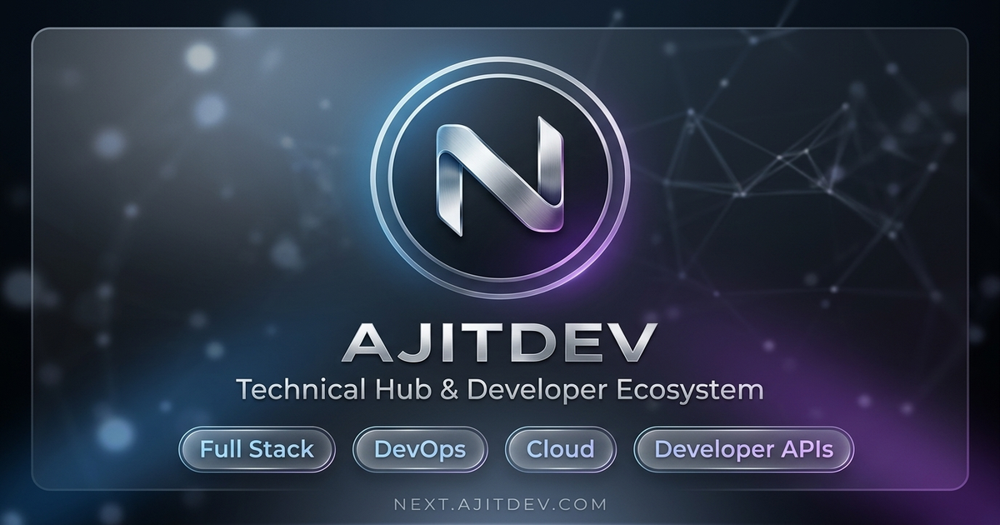

<div align="center">

# NEXT.AJITDEV.COM
### Central Developer Platform, Technical Hub & Engineering Ecosystem

[](https://nextjs.org/)
[](https://react.dev/)
[](https://www.typescriptlang.org/)
[](https://tailwindcss.com/)
[](https://next.ajitdev.com)
[](LICENSE)

<br />



<br />

[**Explore Live Website**](https://next.ajitdev.com) · [**API Hub**](https://api.ajitdev.com) · [**Main Portfolio**](https://www.ajitdev.com) · [**Report Issue**](https://github.com/ajitdev01/next.ajitdev.com/issues)

---

</div>

## 🌟 Overview

**NEXT.AJITDEV.COM** is the primary Next.js engineering platform and developer hub created and maintained by **Ajit Dev** ([@ajitdev01](https://x.com/ajitdev01)). 

It integrates high-performance web engineering, local-first reactive applications, public REST developer APIs, an interactive 3D developer console, and semantic JSON-LD structured schema graphs into a single, cohesive developer ecosystem.

---

## 🚀 Key Engineering Pillars

### 1. ⚡ Local-First & Browser Sovereignty
- **Zero Cloud Surveillance**: Full offline productivity tools built directly into the browser.
- **Optimistic State Architecture**: 0ms interaction lag with instant state updates backed by `IndexedDB` & `LocalStorage`.
- **Privacy First**: Data lives physically on your device with 1-click JSON state export.
- **Productivity Suite**: Integrated [Notes SPA](https://next.ajitdev.com/note) and [Offline Todo Manager](https://next.ajitdev.com/todo).

### 2. 🌐 4-Tier System Topology & Data Flow
- **Tier 1 — Client Tier**: Next.js 16 SPA (React 19, Local-First UI, 1ms local budget).
- **Tier 2 — Edge Gateway**: Cloudflare Global Anycast DNS & Edge Handshake (TLS 1.3 / CORS, 4ms latency).
- **Tier 3 — API Services**: Public REST & JSON services hosted on `api.ajitdev.com` (Node.js microservices, 8ms latency).
- **Tier 4 — Storage Tier**: MongoDB Atlas Cluster (Replicated & fault-tolerant, 12ms commit).

### 3. 🛠️ Interactive Developer Console
- **REST API Console**: Live streaming HTTP/3 QUIC chunk visualizer for `https://api.ajitdev.com/v1/health`.
- **CI/CD Pipeline Matrix**: Simulated multi-stage GitHub Actions workflow tracking linting, type-checking, Docker image caching, and edge rollout.
- **Distributed Topology Inspector**: Interactive step-by-step request flow trace visualizer across all 4 system tiers.

### 4. 🔍 Semantic SEO & Connected Knowledge Graph
- **Connected Graph Architecture**: Built-in JSON-LD schemas connecting `WebSite`, `Person`, `WebPage`, and `BreadcrumbList`.
- **Dynamic Meta & OpenGraph**: Auto-generated 1200×630 OpenGraph and Twitter cards for rich link previews across WhatsApp, LinkedIn, X, and Slack.
- **Native RSS & Sitemap**: Automatic XML feeds at `/feed.xml`, `/rss.xml`, `/sitemap.xml`, and `/robots.txt`.

---

## 🌐 Verified Ecosystem Network

| Subdomain / Service | Domain | Description | Status |
| :--- | :--- | :--- | :---: |
| **Main Ecosystem** | [`ajitdev.com`](https://www.ajitdev.com/) | Personal portfolio, technical articles & verified identity | `LIVE` |
| **Developer API Hub** | [`api.ajitdev.com`](https://api.ajitdev.com/) | Free public REST & JSON developer endpoints | `ACTIVE` |
| **Next.js Hub** | [`next.ajitdev.com`](https://next.ajitdev.com) | Central Next.js project ecosystem & developer tools | `LIVE` |
| **Education Engine** | [`brainzima.com`](https://www.brainzima.com/) | EdTech platform & developer learning utilities | `LIVE` |
| **Developer Discovery** | [`bifindr.com`](https://bifindr.com/) | Curated developer & business discovery engine | `LIVE` |
| **Bespoke Software** | [`rexvel.com`](https://rexvel.com/) | Web development & custom software engineering | `LIVE` |
| **Developer Sandbox** | [`try.ajitdev.com`](https://try.ajitdev.com/) | Interactive app previews & developer sandboxes | `LIVE` |

---

## 💻 Tech Stack & Infrastructure

- **Framework**: [Next.js 16](https://nextjs.org) (App Router, Server Components & Actions)
- **UI & Logic**: [React 19](https://react.dev), [TypeScript 5](https://www.typescriptlang.org)
- **Styling**: [Tailwind CSS v4](https://tailwindcss.com) (Vanilla CSS tokens, custom scrollbars, zero-lag radial gradients)
- **Animations**: [Framer Motion](https://www.framer.com/motion/) (Hardware-accelerated layout transitions)
- **Icons**: [Lucide React](https://lucide.dev)
- **Analytics & Telemetry**: Vercel Web Analytics, Microsoft Clarity, Google Tag Manager (GTM)
- **Deployment**: [Vercel Edge Network](https://vercel.com)

---

## 📁 Repository Structure

```
next.ajitdev.com/
├── app/
│   ├── about/            # Developer Bio & Engineering Principles Page
│   ├── api/              # Public API Documentation Console & Routes
│   ├── components/       # Core UI Components
│   │   ├── engineering-pillars.tsx   # 6 Core Tech Stack Cards
│   │   ├── footer.tsx                # Semantic Global Footer
│   │   ├── header.tsx                # Sticky Navigation with Metallic N Logo
│   │   ├── hero-3d-visualizer.tsx    # Interactive Developer Console
│   │   └── scroll-to-top.tsx         # Floating Scroll-To-Top Control
│   ├── feed.xml/         # Dynamic RSS / XML Feed Generator
│   ├── note/             # Local-First Private Notes Application
│   ├── projects/         # Full Stack & DevOps Projects Showcase
│   ├── todo/             # Offline Sovereign Task Manager
│   ├── globals.css       # Custom CSS & Hardware-Accelerated Tokens
│   ├── layout.tsx        # Root Layout & Metadata Graph Configuration
│   ├── opengraph-image.tsx # Next.js Dynamic OG Generator
│   ├── page.tsx          # Main Homepage
│   ├── robots.ts         # Robots.txt Configuration
│   └── sitemap.ts        # Dynamic XML Sitemap Generator
├── components/
│   ├── seo/              # JSON-LD Schema Injector & Breadcrumb Components
│   └── ui/               # ScrollReveal Motion Wrappers
├── lib/
│   └── seo/             # Structured Data Graph Builders & Config
├── public/               # Public Brand Assets Suite
│   ├── logo.png          # 1024x1024 Metallic Ribbon N Emblem
│   ├── og-image.png      # 1200x630 Social Preview Card
│   ├── favicon.ico       # Multi-resolution ICO
│   ├── favicon.svg       # Vector SVG Tab Icon
│   ├── apple-touch-icon.png # 180x180 iOS Icon
│   └── manifest.json     # PWA Web App Manifest
└── README.md
```

---

## 🛠️ Quick Start & Local Setup

### Prerequisites
- **Node.js**: `v20.0.0` or higher
- **Package Manager**: `npm` (v10+), `pnpm`, or `yarn`

### Installation

1. **Clone the Repository**:
   ```bash
   git clone https://github.com/ajitdev01/next.ajitdev.com.git
   cd next.ajitdev.com
   ```

2. **Install Dependencies**:
   ```bash
   npm install
   ```

3. **Run Development Server**:
   ```bash
   npm run dev
   ```

4. **Access Local Server**:
   Open [http://localhost:3000](http://localhost:3000) in your browser.

5. **Type Checking & Production Build**:
   ```bash
   # Run TypeScript Typecheck
   npx tsc --noEmit

   # Create Production Build
   npm run build
   ```

---

## 👨‍💻 Author & Connect

**Ajit Dev**
- **Website**: [https://www.ajitdev.com](https://www.ajitdev.com)
- **API Hub**: [https://api.ajitdev.com](https://api.ajitdev.com)
- **X / Twitter**: [@ajitdev01](https://x.com/ajitdev01)
- **Instagram**: [@ajitdev01](https://www.instagram.com/ajitdev01/)
- **GitHub**: [@ajitdev01](https://github.com/ajitdev01)
- **LeetCode**: [ajitdev01](https://leetcode.com/u/ajitdev01/)

---

## 📄 License

Distributed under the MIT License. See `LICENSE` for details.

<div align="center">
  <sub>Engineered with ❤️ by <strong>Ajit Dev</strong> · Built for performance, privacy, and scale.</sub>
</div>
